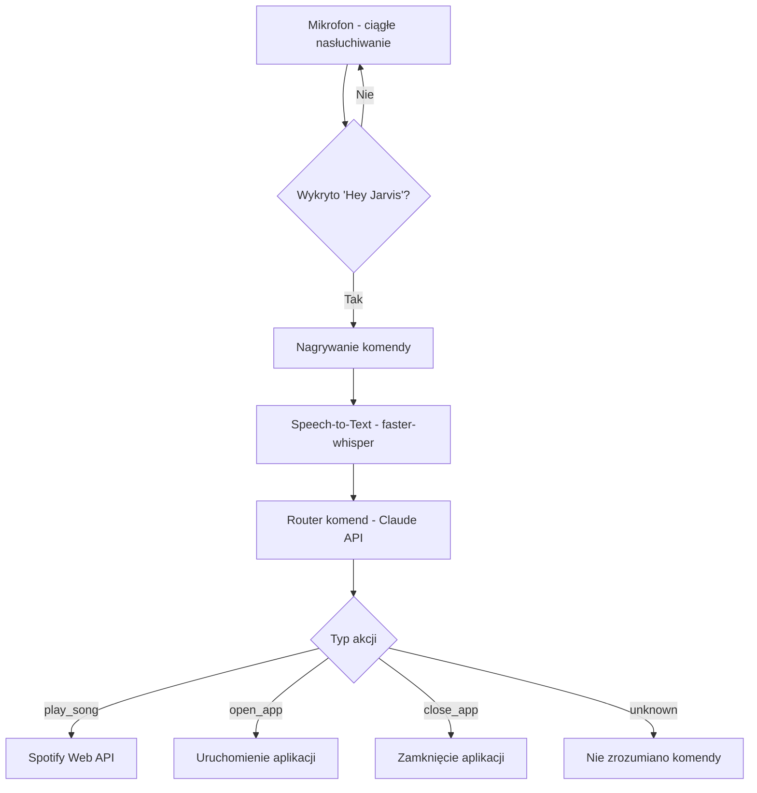

https://github.com/user-attachments/assets/33d63e38-b3db-4a40-871d-0c1916f2d56b

# 🤖 Jarvis — Osobisty Asystent Głosowy

Asystent głosowy sterowany komendami mowy, inspirowany Jarvisem z filmów o Iron Manie. Wykrywa słowo aktywujące, rozumie polecenia w języku naturalnym i wykonuje je — odtwarza muzykę w Spotify, otwiera i zamyka aplikacje na komputerze.

## ✨ Funkcje

- 🎙️ **Wykrywanie słowa aktywującego** — działa w tle, aktywuje się na komendę "Hey Jarvis"; przy polskiej wymowie niepewne trafienia potwierdza małym modelem Whispera (`python wake_word_listener.py kalibracja` sprawdza Twoją wymowę)
- ✋ **Wchodzenie w słowo** — "Hey Jarvis" w trakcie odpowiedzi: Jarvis milknie, przestaje generować i od razu słucha nowego polecenia; przez Telegram to samo robi wiadomość "stop"
- 🗣️ **Rozpoznawanie mowy** — zamiana głosu na tekst lokalnie (polski i angielski); słownik podpowiedzi z Twoich wykonawców, albumów i aplikacji pomaga trafiać w nazwy własne ("Jarvis, zapamiętaj słowo Tarcho Terror" dopisuje własne)
- 🧠 **Rozumienie intencji** — analiza komend przez Claude API
- 🎵 **Sterowanie Spotify** — wyszukiwanie i odtwarzanie utworów i albumów, pauza, wznowienie, następny/poprzedni, "co teraz gra", losowo i powtarzanie
- 🚀 **Uruchamianie i zamykanie aplikacji** — na podstawie komend głosowych
- 🌐 **Strony w Operze GX** — otwieranie stron i wyszukiwanie fraz (Google, YouTube i inne serwisy)
- 🔊 **Sterowanie komputerem** — głośność, jasność ekranu, blokada, uśpienie, restart i wyłączenie (restart i wyłączenie po potwierdzeniu głosem)
- 📝 **Notatki głosowe** — zapis do pliku Markdown z datą dnia (`notatki/2026-09-24.md`) i odczyt dzisiejszych
- 🧠 **Pamięć długoterminowa** — "zapamiętaj, że pracuję do 16", "co o mnie wiesz?", "zapomnij o…"; zapis tylko na wyraźną prośbę, do `memory.json` (poza gitem); haseł, kluczy i kodów nie zapisuje nigdy
- 👁️ **Czytanie ekranu** — "co jest na ekranie?", "przeczytaj ten błąd", "streść tę stronę"; zrzut zmniejszony do 1280 px, tylko w pamięci
- 📋 **Schowek** — tłumaczenie, streszczanie i poprawianie skopiowanego tekstu; dłuższy wynik trafia z powrotem do schowka
- 🩺 **Stan komputera** — procesor, RAM, karta NVIDIA, wolne miejsce, działające programy, niedokończone pobierania; zrzut ekranu na Telegram
- 📱 **Telegram** — rozmowa z telefonu tekstem i głosówkami, odpowiedzi też jako głosówki, przypomnienia na telefon
- 📧 **Poczta (Gmail, tylko odczyt)** — szukanie maili po słowach i nadawcy z ostatnich godzin; czujki "daj znać, jak przyjdzie mail od…" z powiadomieniem głosówką na Telegram; treść maili to dla Jarvisa wyłącznie dane, nigdy polecenia
- 📅 **Kalendarz Google (tylko odczyt)** — "co mam jutro?", "co mam w piątek?", "czy mam coś 12.10?"; z wydarzeniami powtarzającymi się, w strefie Europe/Warsaw
- ☀️ **Poranny briefing** — "co dziś?": dzień, data, godzina, pogoda, dzisiejsze wydarzenia z kalendarza, przypomnienia i wczorajsze notatki w kilku zdaniach
- ⏰ **Przypomnienia i timery** — "za 20 minut", "jutro o ósmej"; przetrwają restart, a przypomnienie czeka, aż Jarvis skończy mówić lub słuchać
- 🔍 **Automatyczne wykrywanie zainstalowanych programów** — przeszukuje Menu Start i zapamiętuje lokalizacje
- 📈 **Odczyty w rogu HUD-a** — procesor, pamięć, prędkość sieci (z zapamiętanym szczytem) i temperatura z limitem
- 💫 **Wizualny interfejs** — pulsujące, świecące okienko reagujące na stan asystenta (nasłuchuje / przetwarza / błąd)
- 📌 **Działanie w tle** — ikona w zasobniku systemowym

## 🧠 Jak to działa



## 🛠️ Stos technologiczny

| Komponent | Technologia |
|---|---|
| Wykrywanie wake worda | openWakeWord |
| Speech-to-Text | faster-whisper |
| Rozpoznawanie intencji | Claude API (Anthropic) |
| Integracja ze Spotify | Spotipy (Spotify Web API) |
| Interfejs graficzny | PySide6 |
| Zarządzanie procesami | psutil, pywin32 |

## 🚀 Instalacja

```bash
git clone https://github.com/klosuj3bator/Jarvis-voice-assistant.git
cd Jarvis-voice-assistant
python -m venv venv
venv\Scripts\activate
pip install -r requirements.txt
```

## ⚙️ Konfiguracja

Stwórz plik `.env` w głównym folderze na podstawie `.env.example` i uzupełnij własnymi kluczami:

SPOTIPY_CLIENT_ID=twoj_client_id
SPOTIPY_CLIENT_SECRET=twoj_client_secret
SPOTIPY_REDIRECT_URI=http://127.0.0.1:8888/callback
ANTHROPIC_API_KEY=twoj_klucz_api


- Klucze Spotify: [Spotify Developer Dashboard](https://developer.spotify.com/dashboard) (wymaga konta Premium)
- Klucz Anthropic: [Claude Platform](https://platform.claude.com)

### 📱 Telegram (opcjonalnie)

Rozmowa z Jarvisem z telefonu — tekstem i głosówkami. Bez tych kluczy Jarvis działa normalnie, tylko bez Telegrama.

TELEGRAM_JARVIS_TOKEN=token_od_BotFather
TELEGRAM_OWNER_ID=twoje_id

1. W Telegramie napisz do **@BotFather**, wyślij `/newbot` i wybierz nazwę. Dostaniesz token — wpisz go jako `TELEGRAM_JARVIS_TOKEN`.
2. Uruchom `python telegram_bridge.py kto-ja` i napisz cokolwiek do swojego bota. Skrypt wypisze Twoje ID — wpisz je jako `TELEGRAM_OWNER_ID`.
3. Uruchom Jarvisa ponownie.

Bot odpowiada **wyłącznie** na Twoje ID; wiadomości od innych ignoruje i zapisuje w dzienniku. Restart i wyłączenie komputera z telefonu wymagają odpisania „tak”.

### 📅 Kalendarz Google (opcjonalnie)

GOOGLE_CALENDAR_ICAL_URL=tajny_adres_ical

1. Otwórz [Kalendarz Google](https://calendar.google.com) → ⚙️ **Ustawienia** → po lewej wybierz swój kalendarz.
2. W sekcji **Integracja kalendarza** skopiuj **Tajny adres w formacie iCal** i wpisz go do `.env`.
3. Uruchom Jarvisa ponownie. `python kalendarz.py jutro` pokazuje, co Jarvis widzi.

Ten adres działa jak hasło — kto go zna, czyta cały kalendarz. Jarvis nie zapisuje go w dzienniku ani nie wysyła modelowi. Gdyby wyciekł, w tym samym miejscu ustawień jest przycisk **Resetuj**. Jarvis widzi tylko godzinę, tytuł i miejsce wydarzeń (bez opisów), a wydarzeń, które odrzuciłeś, nie pokazuje.

### 🎧 Słownik nazw ze Spotify (opcjonalnie)

Żeby Whisper lepiej rozpoznawał Twoich wykonawców i albumy, słownik podpowiedzi zagląda do historii słuchania i obserwowanych wykonawców. To inne uprawnienia niż sterowanie muzyką, więc zgodę dajesz raz, osobno:

```bash
python slownik.py spotify
```

Bez tego słownik działa na aplikacjach, pamięci i ręcznie dopisanych słowach. `python slownik.py` pokazuje, co jest w słowniku.

### 📧 Poczta Gmail (opcjonalnie)

Szukanie maili i czujki na nowe maile. Bez tych kluczy Jarvis działa normalnie, tylko bez poczty.

GMAIL_ADDRESS=twoj_adres@gmail.com
GMAIL_APP_PASSWORD=haslo_aplikacji

1. Włącz weryfikację dwuetapową na koncie Google.
2. Wejdź na [myaccount.google.com/apppasswords](https://myaccount.google.com/apppasswords), utwórz hasło aplikacji (np. „Jarvis”) i wpisz je jako `GMAIL_APP_PASSWORD`. **Nie wpisuj zwykłego hasła do konta.**
3. Uruchom Jarvisa ponownie.

Skrzynka jest otwierana **tylko do odczytu** — Jarvis nie oznacza maili jako przeczytane, niczego nie usuwa i nie wysyła. Widzi tylko nadawcę, temat i godzinę, bez treści maila. Czujki sprawdzają pocztę co 5 minut; o każdym mailu powiadamiają tylko raz (tekstem i głosówką na Telegram, więc wymagają skonfigurowanego Telegrama). Reguły są zapisane w `email_watches.json`.

## ▶️ Użycie

```bash
python main.py
```

Powiedz **"Hey Jarvis"**, a następnie komendę, np.:
- *"Puść piosenkę Bohemian Rhapsody"*
- *"Następna"*, *"Pauza"*, *"Co to za kawałek?"*
- *"Otwórz Chrome"*
- *"Zamknij Spotify"*
- *"Odpal Operę GX i włącz mi Gmaila"*
- *"Wpisz w operze przepis na pizzę"*
- *"Przycisz do trzydziestu procent"*
- *"Ustaw jasność na sześćdziesiąt"*
- *"Zablokuj ekran"*
- *"Zanotuj, że mam oddać książkę"*
- *"Co dziś zanotowałem?"*
- *"Zapamiętaj, że pracuję do szesnastej"*, *"Co o mnie wiesz?"*, *"Zapomnij, do której pracuję"*
- *"Zapamiętaj słowo Tarcho Terror"* (dokładną pisownię najpewniej podasz tekstem przez Telegram)
- *"Przypomnij mi za 20 minut o praniu"*
- *"Timer na 5 minut"*
- *"Jakie mam przypomnienia?"*
- *"Co dziś?"* / *"Poranny briefing"* / *"Good morning"*
- *"Co mam jutro?"*, *"O której mam dentystę w poniedziałek?"*, *"Co mam dwunastego października?"*
- *"Jak się ma komputer?"*, *"Co mi zjada procesor?"*, *"Jak idzie pobieranie?"*
- *"Przetłumacz to, co skopiowałem"*, *"Streść to"*, *"Popraw błędy w tym tekście"*
- *"Co jest na ekranie?"*, *"Przeczytaj ten błąd i powiedz, co się stało"*, *"Co jest na drugim monitorze?"*
- *"Czy przyszedł mail ze słowami rekrutacja, praca, AI w ciągu 4 godzin?"*
- *"Daj znać, jak przyjdzie mail od Allegro"*, *"Na jakie maile czekasz?"*, *"Anuluj czujkę na Allegro"*

## ⚠️ Znane ograniczenia

- Wchodzenie w słowo najpewniej działa na słuchawkach. Na głośnikach mikrofon słyszy też Jarvisa; w testach Twoje "Hey Jarvis" i tak się przebijało, ale przy bardzo głośnych głośnikach może nie zadziałać. Narzędzia w toku (np. szukanie w Spotify) kończą się przed przerwaniem — Jarvis milknie od razu, ale nie przerywa ich w połowie

- Sterowanie odtwarzaniem w Spotify wymaga konta **Premium**
- Rozpoznawanie mowy może mieć trudności z nietypowymi nazwami własnymi
- Projekt obecnie działa na **Windows** (wykorzystuje polecenia specyficzne dla tego systemu)

## 🔭 Plany rozwoju

- Odpowiedzi głosowe asystenta (Text-to-Speech)
- Wykrywanie ciszy zamiast stałego czasu nagrywania

## 👤 Autor

Maciek — [GitHub](https://github.com/klosuj3bator)
