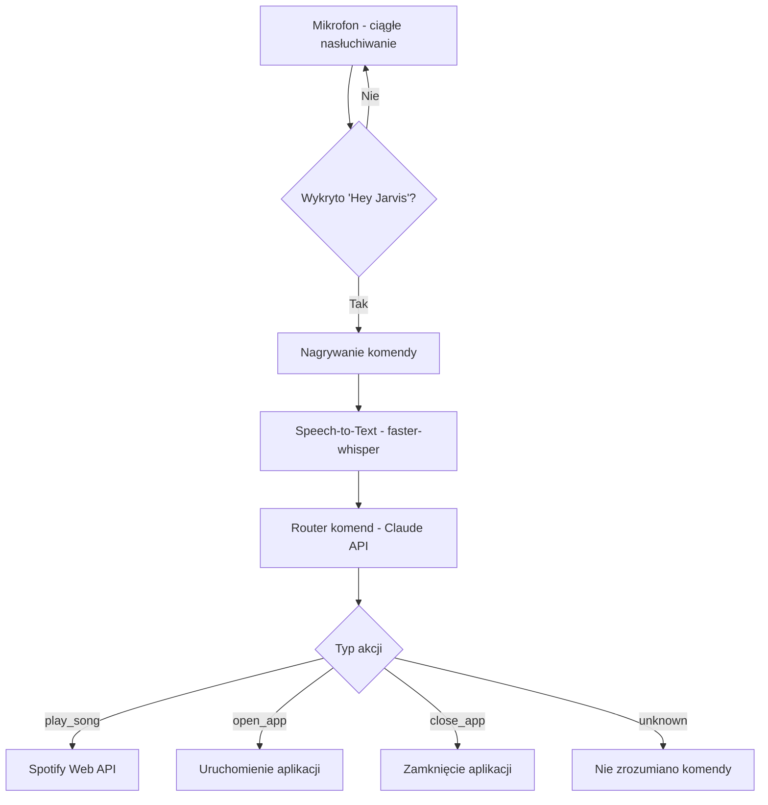

https://github.com/user-attachments/assets/33d63e38-b3db-4a40-871d-0c1916f2d56b

# 🤖 Jarvis — Osobisty Asystent Głosowy

Asystent głosowy sterowany komendami mowy, inspirowany Jarvisem z filmów o Iron Manie. Wykrywa słowo aktywujące, rozumie polecenia w języku naturalnym i wykonuje je — odtwarza muzykę w Spotify, otwiera i zamyka aplikacje na komputerze.

## ✨ Funkcje

- 🎙️ **Wykrywanie słowa aktywującego** — działa w tle, aktywuje się na komendę "Hey Jarvis"
- 🗣️ **Rozpoznawanie mowy** — zamiana głosu na tekst lokalnie (polski i angielski)
- 🧠 **Rozumienie intencji** — analiza komend przez Claude API
- 🎵 **Sterowanie Spotify** — wyszukiwanie i odtwarzanie utworów przez Spotify Web API
- 🚀 **Uruchamianie i zamykanie aplikacji** — na podstawie komend głosowych
- 🔍 **Automatyczne wykrywanie zainstalowanych programów** — przeszukuje Menu Start i zapamiętuje lokalizacje
- 💫 **Wizualny interfejs** — pulsujące, świecące okienko reagujące na stan asystenta (nasłuchuje / przetwarza / błąd)
- 📌 **Działanie w tle** — ikona w zasobniku systemowym

## 🧠 Jak to działa



## 🛠️ Stos technologiczny

| Komponent | Technologia |
|---|---|
| Wykrywanie wake worda | openWakeWord |
| Speech-to-Text | faster-whisper |
| Rozpoznawanie intencji | Claude API (Anthropic) |
| Integracja ze Spotify | Spotipy (Spotify Web API) |
| Interfejs graficzny | PySide6 |
| Zarządzanie procesami | psutil, pywin32 |

## 🚀 Instalacja

```bash
git clone https://github.com/klosuj3bator/Jarvis-voice-assistant.git
cd Jarvis-voice-assistant
python -m venv venv
venv\Scripts\activate
pip install -r requirements.txt
```

## ⚙️ Konfiguracja

Stwórz plik `.env` w głównym folderze na podstawie `.env.example` i uzupełnij własnymi kluczami:

SPOTIPY_CLIENT_ID=twoj_client_id
SPOTIPY_CLIENT_SECRET=twoj_client_secret
SPOTIPY_REDIRECT_URI=http://127.0.0.1:8888/callback
ANTHROPIC_API_KEY=twoj_klucz_api


- Klucze Spotify: [Spotify Developer Dashboard](https://developer.spotify.com/dashboard) (wymaga konta Premium)
- Klucz Anthropic: [Claude Platform](https://platform.claude.com)

## ▶️ Użycie

```bash
python main.py
```

Powiedz **"Hey Jarvis"**, a następnie komendę, np.:
- *"Puść piosenkę Bohemian Rhapsody"*
- *"Otwórz Chrome"*
- *"Zamknij Spotify"*

## ⚠️ Znane ograniczenia

- Sterowanie odtwarzaniem w Spotify wymaga konta **Premium**
- Rozpoznawanie mowy może mieć trudności z nietypowymi nazwami własnymi
- Projekt obecnie działa na **Windows** (wykorzystuje polecenia specyficzne dla tego systemu)

## 🔭 Plany rozwoju

- Odpowiedzi głosowe asystenta (Text-to-Speech)
- Wykrywanie ciszy zamiast stałego czasu nagrywania

## 👤 Autor

Maciek — [GitHub](https://github.com/klosuj3bator)
