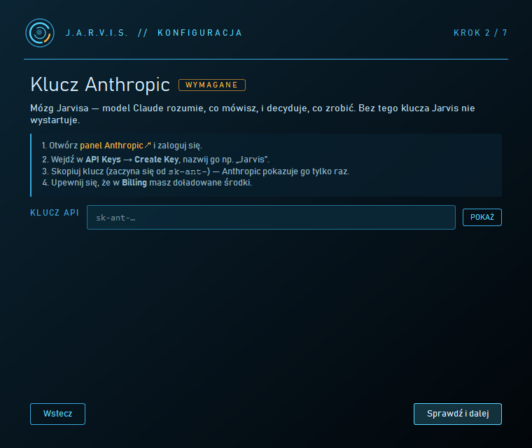
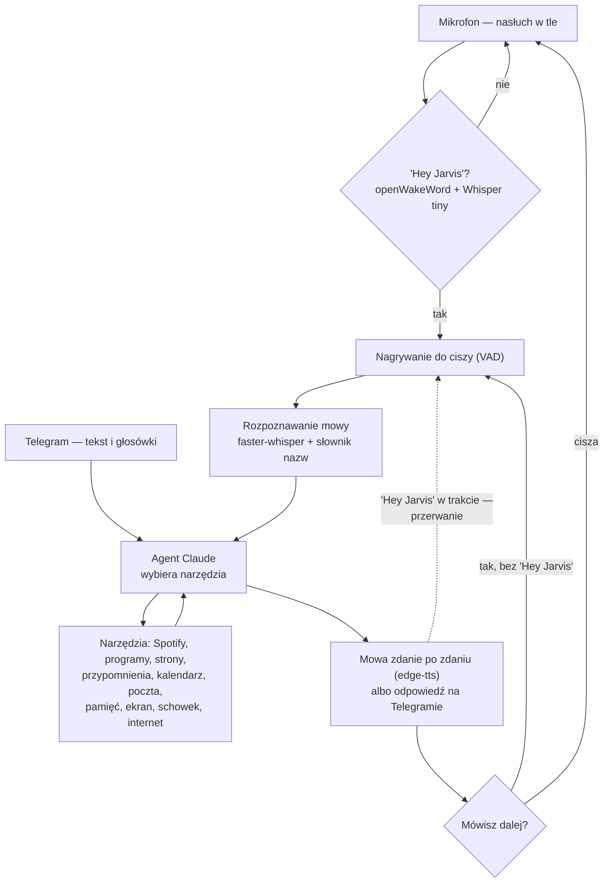

# 🤖 Jarvis — osobisty asystent głosowy

Asystent głosowy dla Windows inspirowany Jarvisem z filmów o Iron Manie. Mówisz **„Hey Jarvis”**, a on rozumie polecenia w naturalnym języku, prowadzi rozmowę i sam sięga po narzędzia: puszcza muzykę w Spotify, otwiera programy i strony, pilnuje przypomnień, czyta kalendarz i pocztę, odpowiada na pytania z internetu. Możesz z nim też pisać i nagrywać głosówki przez Telegram.

Mózgiem jest model **Claude** (Anthropic), a rozpoznawanie mowy i słowa aktywującego działa **lokalnie** na Twoim komputerze. Rozmawia po polsku.

## ✨ Co potrafi

**Rozmowa i głos**
- 🎙️ **„Hey Jarvis”** — nasłuch w tle; przy polskiej wymowie niepewne trafienia potwierdza małym modelem Whispera
- 💬 **Rozmowa bez powtarzania „Hey Jarvis”** — po pierwszym poleceniu słucha dalej; odróżnia zdania do siebie od rozmów ludzi w pokoju
- ✋ **Wchodzenie w słowo** — „Hey Jarvis” w trakcie odpowiedzi: milknie, przestaje generować i od razu słucha nowego polecenia
- 🗣️ **Rozpoznawanie mowy lokalnie** (faster-whisper) ze słownikiem nazw własnych — Twoi wykonawcy, albumy i aplikacje; „zapamiętaj słowo Tarcho Terror” dopisuje własne
- 🔊 **Odpowiedzi głosem**, zdanie po zdaniu, bez czekania na całą odpowiedź
- 🧠 **Pamięć długoterminowa** — „zapamiętaj, że pracuję do 16”, „co o mnie wiesz?”; zapisuje tylko na wyraźną prośbę i nigdy nie zapisuje haseł, kluczy ani kodów

**Muzyka i komputer**
- 🎵 **Spotify** — utwory i albumy, pauza, następny, „co teraz gra”, losowo, powtarzanie
- 🚀 **Programy** — uruchamianie i zamykanie; sam znajduje zainstalowane aplikacje w menu Start
- 🌐 **Strony w Operze GX** — otwieranie adresów i wyszukiwanie fraz (Google, YouTube i inne)
- 🔊 **Sterowanie komputerem** — głośność, jasność, blokada, uśpienie, restart i wyłączenie (te dwa ostatnie dopiero po potwierdzeniu)
- 👁️ **Czytanie ekranu** — „co jest na ekranie?”, „przeczytaj ten błąd”, „streść tę stronę”
- 📋 **Schowek** — tłumaczenie, streszczanie i poprawianie skopiowanego tekstu
- 🩺 **Stan komputera** — procesor, RAM, karta NVIDIA, dyski, działające programy, pobierania

**Organizacja i informacje**
- ⏰ **Przypomnienia i timery** — „za 20 minut”, „jutro o ósmej”; przetrwają restart
- 📝 **Notatki głosowe** — zapis do plików Markdown z datą
- 📅 **Kalendarz Google** (tylko odczyt) — „co mam jutro?”, z wydarzeniami powtarzającymi się
- 📧 **Poczta Gmail** (tylko odczyt) — szukanie maili i czujki „daj znać, jak przyjdzie mail od…”
- ☀️ **Poranny briefing** — „co dziś?”: data, pogoda, kalendarz, przypomnienia w kilku zdaniach
- 🔎 **Internet** — pogoda, wyniki, bieżące sprawy przez wyszukiwarkę

**Telefon i wygląd**
- 📱 **Telegram** — rozmowa tekstem i głosówkami, odpowiedzi też głosówkami, przypomnienia i powiadomienia o mailach na telefon; „stop” przerywa odpowiedź
- 💫 **HUD na pełnym ekranie** w stylu Iron Mana — pierścienie reagujące na stan (czuwam / słucham / myślę / mówię), zegar, procesor, pamięć, sieć i temperatura
- 📌 **Działanie w tle** — ikona w zasobniku przy zegarku, w jej menu **Ustawienia**

## 💬 Przykładowe polecenia

Powiedz **„Hey Jarvis”**, a potem na przykład:

- *„Puść album Nevermind”*, *„Następna”*, *„Co to za kawałek?”*
- *„Otwórz Chrome”*, *„Odpal Operę GX i włącz mi Gmaila”*, *„Wpisz w operze przepis na pizzę”*
- *„Przycisz do trzydziestu procent”*, *„Zablokuj ekran”*
- *„Przypomnij mi za 20 minut o praniu”*, *„Timer na 5 minut”*
- *„Co dziś?”*, *„Co mam jutro?”*, *„O której mam dentystę w poniedziałek?”*
- *„Czy przyszedł mail ze słowami rekrutacja, praca, AI w ciągu 4 godzin?”*, *„Daj znać, jak przyjdzie mail od Allegro”*
- *„Zapamiętaj, że pracuję do szesnastej”*, *„Co o mnie wiesz?”*, *„Zapomnij, do której pracuję”*
- *„Przetłumacz to, co skopiowałem”*, *„Co jest na ekranie?”*, *„Co mi zjada procesor?”*
- *„Zanotuj, że mam oddać książkę”*, *„Jaka jutro pogoda?”*

## 📥 Instalacja

**Wymagania:** Windows 10 lub 11 (64-bit), mikrofon, internet, ok. 1 GB miejsca (program + modele mowy) i klucz API Anthropic z doładowanymi środkami.

### Instalator (dla większości osób)

1. Pobierz `JarvisSetup.exe` z zakładki [Releases](https://github.com/klosuj3bator/Jarvis-voice-assistant/releases) i uruchom. Nie potrzebuje uprawnień administratora.
2. Windows może ostrzec przed nieznanym wydawcą — instalator nie jest jeszcze podpisany certyfikatem. Wybierz **Więcej informacji → Uruchom mimo to**.
3. Przy pierwszym uruchomieniu kreator poprosi o klucze i pobierze modele mowy (ok. 560 MB, zwykle kilka minut).

Instalator dodaje skrót na pulpicie, wpis w menu Start i — jeśli zaznaczysz — autostart z Windowsem. Deinstalator jest w Ustawieniach Windows → Aplikacje.

### Z kodu źródłowego

Projekt jest rozwijany na Pythonie 3.14.

```bash
git clone https://github.com/klosuj3bator/Jarvis-voice-assistant.git
```

```bash
cd Jarvis-voice-assistant
```

```bash
python -m venv venv
```

```bash
venv\Scripts\activate
```

```bash
pip install -r requirements.txt
```

```bash
python main.py
```

`python main.py` pokazuje dziennik na żywo w terminalu; `Jarvis.pyw` uruchamia Jarvisa w tle, bez okna konsoli.

## ⚙️ Konfiguracja

Przy pierwszym uruchomieniu otwiera się **kreator**. Wymagany jest tylko klucz Anthropic — Spotify, Telegram, Gmail i kalendarz możesz pominąć i dodać później w **Ustawieniach** (prawy przycisk na ikonie Jarvisa przy zegarku). Przy każdym kluczu jest instrukcja i link, a przycisk **„Sprawdź i dalej”** łączy się z usługą, zanim puści Cię dalej — zły klucz wychodzi od razu.

<p align="center"></p>

| Usługa | Do czego | Skąd klucz |
|---|---|---|
| **Anthropic** (wymagany) | mózg Jarvisa — model Claude | [platform.claude.com](https://platform.claude.com) → API Keys |
| Spotify | muzyka (sterowanie wymaga konta Premium) | [developer.spotify.com/dashboard](https://developer.spotify.com/dashboard) → Create app, Redirect URI `http://127.0.0.1:8888/callback` |
| Telegram | rozmowa z telefonu, powiadomienia | [@BotFather](https://t.me/BotFather) → `/newbot`; swoje ID wykryje kreator |
| Gmail | szukanie maili, czujki | [hasło aplikacji](https://myaccount.google.com/apppasswords) (wymaga weryfikacji dwuetapowej) — nie zwykłe hasło |
| Kalendarz Google | „co mam jutro?” | [ustawienia kalendarza](https://calendar.google.com/calendar/r/settings) → Integracja kalendarza → Tajny adres w formacie iCal |

Funkcje bez kluczy są wyłączone — Jarvis mówi wtedy wprost, że dana funkcja nie jest skonfigurowana.

**Gdzie leżą klucze i dane.** Kreator zapisuje klucze w `%APPDATA%\Jarvis\config.env`. Wersja z instalatora trzyma tam też całą resztę: pamięć, notatki, przypomnienia, dziennik i modele mowy. Uruchamiana z kodu trzyma dane obok kodu, a klucze możesz też wpisać do pliku `.env` (wzór: `.env.example`) — kolejność ważności: zmienne środowiskowe Windows → Ustawienia → `.env`.

**Słownik nazw ze Spotify (opcjonalnie).** Żeby Whisper lepiej rozpoznawał Twoich wykonawców, słownik zagląda do historii słuchania. To osobne uprawnienia, więc zgodę dajesz raz: `python slownik.py spotify`.

## 🔒 Prywatność i bezpieczeństwo

- **Dźwięk z mikrofonu nie opuszcza komputera.** „Hey Jarvis” i rozpoznawanie mowy działają lokalnie; do Claude trafia tylko tekst polecenia. Tekst odpowiedzi idzie do syntezatora mowy Microsoftu (edge-tts).
- **Maile i zaproszenia z kalendarza to dla Jarvisa wyłącznie dane.** Po odczytaniu poczty narzędzia są blokowane w kodzie do końca odpowiedzi — obcy mail nie wyda Jarvisowi polecenia. Poczta i kalendarz są tylko do odczytu.
- **Telegram odpowiada wyłącznie Tobie** (Twoje ID), obcych ignoruje. Restart i wyłączenie komputera wymagają potwierdzenia.
- **Pamięć tylko na prośbę.** Fakty zapisuje dopiero po „zapamiętaj”; hasła, klucze i kody są odrzucane w kodzie, a wypowiedzi wyglądające na hasło nie trafiają do dziennika.
- **Klucze nigdy nie trafiają do dziennika** ani do repozytorium; skrypt budujący instalator sprawdza, czy w paczce nie ma prywatnych plików ani wartości kluczy.

## 💰 Koszty

Jarvis korzysta z płatnego API Anthropic (model Claude Sonnet 5, z cache promptów). Z prawdziwego używania (dziennik Jarvisa): zwykłe zdanie w rozmowie to **0,3–0,6 centa**, polecenie z narzędziem (np. „puść album…”) ok. 1 centa, pierwsze zdanie po uruchomieniu albo dłuższej przerwie 4–7 centów (wtedy instrukcje zapisują się do cache), pytanie z wyszukiwaniem w internecie ok. 4 centów. Sesja z kilkunastoma poleceniami kosztuje zwykle 10–20 centów. Koszt każdego zapytania i suma od startu są zapisywane w `jarvis.log`. Wątki w tle (przypomnienia, czujki poczty) nie wywołują Claude.

## 🧠 Jak to działa


```mermaid
graph TD
    A["Mikrofon — nasłuch w tle"] --> B{"'Hey Jarvis'?<br/>openWakeWord + Whisper tiny"}
    B -- nie --> A
    B -- tak --> C["Nagrywanie do ciszy (VAD)"]
    C --> D["Rozpoznawanie mowy<br/>faster-whisper + słownik nazw"]
    T["Telegram — tekst i głosówki"] --> E
    D --> E["Agent Claude<br/>wybiera narzędzia"]
    E --> F["Narzędzia: Spotify, programy, strony,<br/>przypomnienia, kalendarz, poczta,<br/>pamięć, ekran, schowek, internet"]
    F --> E
    E --> G["Mowa zdanie po zdaniu (edge-tts)<br/>albo odpowiedź na Telegramie"]
    G --> H{"Mówisz dalej?"}
    H -- "tak, bez 'Hey Jarvis'" --> C
    H -- "cisza" --> A
    G -. "'Hey Jarvis' w trakcie —<br/>przerwanie" .-> C
```

Jeden agent (`agent.py`) prowadzi całą rozmowę: sam decyduje, czy odpowiedzieć, czy sięgnąć po narzędzie, i widzi wyniki narzędzi, więc przy błędzie może spróbować inaczej. Przypomnienia i czujki poczty pilnuje osobny wątek, bez udziału modelu.

## 🛠️ Stos technologiczny

| Część | Technologia |
|---|---|
| Model językowy | Claude Sonnet 5 (Anthropic API) z narzędziami i wyszukiwarką |
| Słowo aktywujące | openWakeWord (+ faster-whisper tiny do potwierdzeń) |
| Rozpoznawanie mowy | faster-whisper (small, CPU) |
| Synteza mowy | edge-tts, PyAV, sounddevice |
| Interfejs | PySide6 (Qt Quick + shader HUD-a, okna Qt Widgets) |
| Integracje | Spotipy, Telegram Bot API, IMAP (Gmail), iCalendar |
| System | psutil, pywin32, pycaw, pynvml |
| Instalator | PyInstaller + Inno Setup |

## 📂 Struktura projektu

| Plik | Co robi |
|---|---|
| `main.py`, `Jarvis.pyw` | start programu, pętla nasłuchu i rozmowy |
| `agent.py` | agent Claude: instrukcje, narzędzia, historia, koszty |
| `wake_word_listener.py` | mikrofon, „Hey Jarvis”, nagrywanie, Whisper, wchodzenie w słowo |
| `tts.py` | mowa zdanie po zdaniu |
| `gui.py`, `hud.qml`, `hud.frag` | HUD na pełnym ekranie i ikona w zasobniku |
| `setup_wizard.py`, `konfiguracja.py` | kreator, Ustawienia, skąd brać klucze |
| `sciezki.py`, `modele.py` | gdzie leżą dane i modele, pobieranie modeli |
| `spotify_controller.py`, `app_launcher.py`, `przegladarka.py`, `system_control.py` | muzyka, programy, strony, sterowanie komputerem |
| `reminders.py`, `notes.py`, `kalendarz.py`, `email_monitor.py`, `briefing.py` | przypomnienia, notatki, kalendarz, poczta, briefing |
| `pamiec.py`, `slownik.py`, `schowek.py`, `stan_komputera.py`, `czujniki.py` | pamięć, słownik nazw, schowek, stan komputera, odczyty HUD-a |
| `telegram_bridge.py` | rozmowa przez Telegram |
| `instalator/` | budowanie instalatora (PyInstaller, Inno Setup, sprawdzanie paczki) |
| `chat.py`, `router.py` | starsza architektura (router + czat), zachowana, nieużywana |

## 📦 Budowanie instalatora

```bash
pip install pyinstaller
```

```bash
winget install JRSoftware.InnoSetup
```

```bash
python instalator/zbuduj.py
```

Skrypt robi po kolei: ikonę → paczkę PyInstallerem w trybie folderu (`dist/Jarvis/`) → **sprawdzenie prywatności** (czy w paczce nie ma `.env`, tokenów, pamięci, notatek, dziennika, modeli ani wartości Twoich kluczy — także w skompilowanym kodzie wewnątrz `Jarvis.exe`; jeśli coś znajdzie, przerywa) → **autotest** zbudowanego `Jarvis.exe` na czystym `%APPDATA%` → instalator Inno Setup (`dist/JarvisSetup.exe`). Zmieniłeś tylko `instalator/jarvis.iss`? Dodaj `--tylko-instalator`. Numer wersji jest w `wersja.py`.

Modeli mowy nie ma w instalatorze (byłby pięć razy większy) — pobiera je kreator. Instalator nie jest podpisany, więc Windows pokazuje ostrzeżenie o nieznanym wydawcy, a Windows Defender bywa podejrzliwy wobec programów z PyInstallera; nową wersję warto zgłosić Microsoftowi jako twórca oprogramowania ([formularz](https://www.microsoft.com/en-us/wdsi/filesubmission) → *Software developer*).

## ⚠️ Znane ograniczenia

- Tylko **Windows** (polecenia systemowe, Opera GX, pywin32).
- Rozpoznawanie mowy liczy na procesorze — od końca wypowiedzi do tekstu mija kilka sekund.
- Wchodzenie w słowo najpewniej działa na słuchawkach; przy bardzo głośnych głośnikach Jarvis może Cię nie usłyszeć. Narzędzie w toku (np. szukanie w Spotify) kończy się przed przerwaniem.
- Sterowanie Spotify wymaga konta **Premium**.
- Temperatura procesora bez LibreHardwareMonitora jest niedostępna — HUD pokazuje wtedy temperaturę karty NVIDIA.

## 🔭 Plany rozwoju

- Podpisany instalator (bez ostrzeżeń Windows)
- Whisper na karcie graficznej (szybsze rozpoznawanie)
- Temperatura procesora przez LibreHardwareMonitor

## 👤 Autor

Maciek — [GitHub](https://github.com/klosuj3bator)
